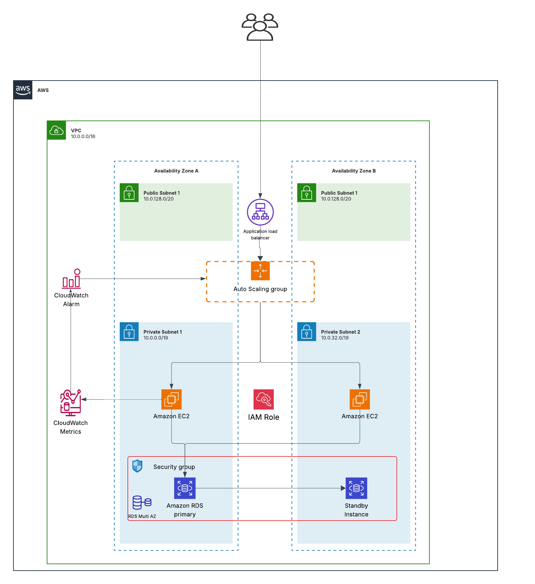

# AWS Solutions Architect – Associate Graduation Projects

## **Author:** Wael Arfaoui

## **Email:** [wael.arfaaoui@gmail.com](mailto:wael.arfaaoui@gmail.com)

## **Profile:** [LinkedIn – Wael Arfaoui](https://www.linkedin.com/in/wael-arfaoui-2b5503213/)

---

## 📘 Project Overview

This repository contains three AWS-based graduation project designed to demonstrate proficiency in **cloud architecture**, **scalability**, and **DevOps automation practices **.

The project includes:

* **Solution Architecture Diagram** (to be displayed at the end of each project section)
* **Documentation & Implementation Guide** (in README)
* **Infrastructure-as-Code (IaC)** templates using **Terraform modules**
* **Optional Demo:** Deployed or recorded demonstration on AWS

---

## 📁 Repository Structure

```bash
Aws-solutions-architect-graduation-project/
│
├── project-1-scalable-webapp-alb-asg/
│   ├── modules/  # Terraform modules (EC2, ALB, ASG, RDS)
│   ├── main.tf
│   ├── variables.tf
│   ├── outputs.tf
│   ├── README.md
│   ├── architecture-diagram.png
│
└── README.md  # main overview file
```

---

## 🚀 Project 1: Scalable Web Application with ALB & Auto Scaling

**Architecture:** EC2-based

### 🧩 Description

Deploy a web application on AWS using **EC2 instances** behind an **Application Load Balancer (ALB)** with **Auto Scaling Groups (ASG)** for high availability. Infrastructure is managed via **Terraform modules**.

### 🏗️ AWS Services

* **EC2:** Launch instances for the web app.
* **Application Load Balancer (ALB):** Distributes traffic.
* **Auto Scaling Group (ASG):** Automatically scales based on load.
* **RDS :** PostgreSQL database with Multi-AZ.
* **IAM:** Role-based access control.
* **CloudWatch & SNS:** Monitoring and alerts.

### 📊 Architecture Diagram



---

## 👨‍💻 Author

**Wael Arfaoui**
**Cloud & DevOps Engineer** from Tunisia
📧 Email: [wael.arfaaoui@gmail.com](mailto:wael.arfaaoui@gmail.com)
🔗 [LinkedIn – Wael Arfaoui](https://www.linkedin.com/in/wael-arfaoui-2b5503213/)
